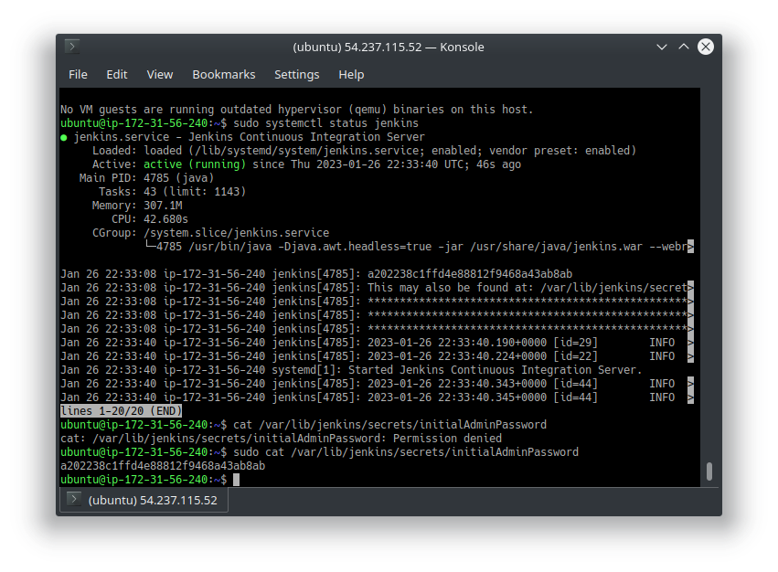
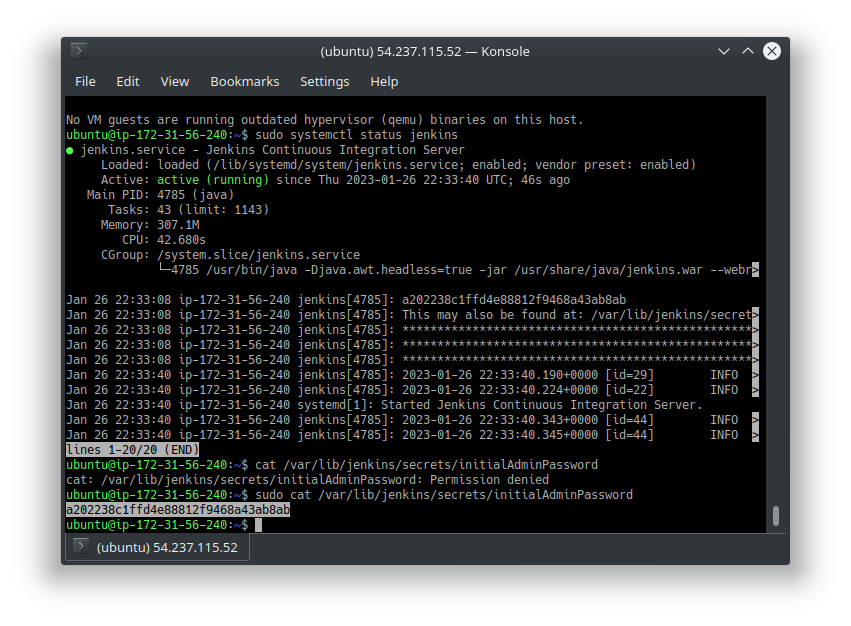
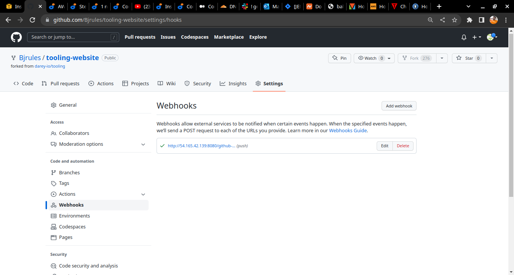

#### This project is another milestone on my DevOps Journey at darey.io as I succefully impleented t Continous Integration using Jenkings 
#### webhook  is triggered by pushing certain updates made from my local vscode 
#### the AUTOMATION is vscode(commit&push)-> Github(webhook) -> jenkins -> webservers(created earlier in Project7 )

 ubuntu 20.04 was used to create jenkins server 
 
 

installing jdk since jenkins is a java program

Installing jenkins

Jenkins status

remember jenkins runs on port 8080 so I created an inbound rule on my EC2 instance in other to access (view) it on my browser and also copied the default password for jenkins

And so I choose Installed suggested plugin

Registeration with user name and password

Using the parameters(jenkins-server-address/github-webhook/ ) to configure webhooks for github

Started using jenkins

Manual building

Installing the  'PUBLISH OVER SSH' plugin to enable the automation process

Configuration the 'Publish Over SSH' Plugin

you have to scoll to almost the bottom of the page to see the form for configuration

At this point to get the 'success' was not possible until I realise that the plugin 'Publish Over SSH in not compatible with RHEL9 I had to go and recreate  and configure my NFS SERVER with RHEL8 
 

Build artifact over SSH

Wow! it works like magic automatically updated my NFS-SERVER and a chain reaction effect on my webserver.
And so DevOps became even more interesting. this is the techniques for software automated release
Thanks Darey.io

